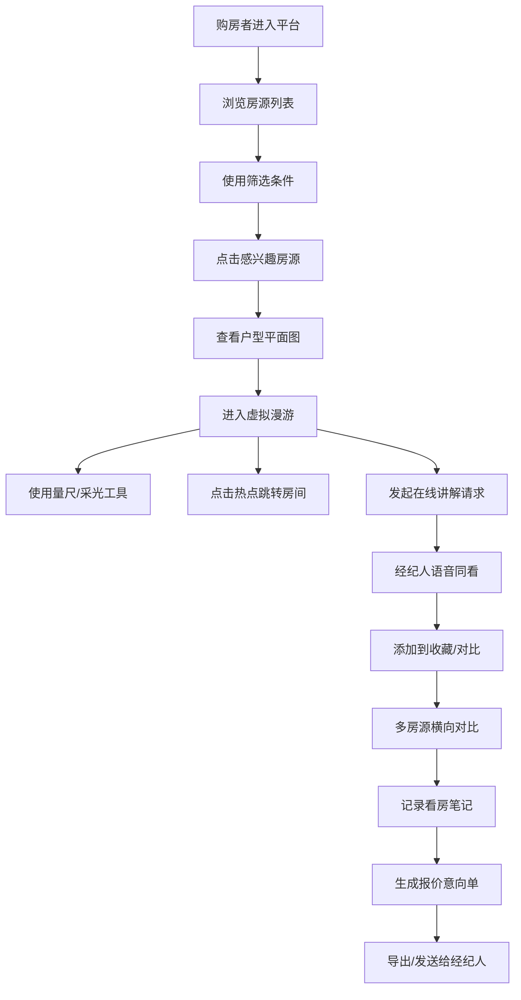

## 1. 产品概述

MetaEstate 元宇宙虚拟看房平台是面向房产中介和购房者的沉浸式 Web 应用，通过3D虚拟漫游技术打破时空限制，让用户足不出户即可完成看房、选房、议价全流程。

- 目标用户：房产经纪人、购房/租房者、投资客
- 核心价值：提升看房效率、降低获客成本、增强互动体验

## 2. 核心功能

### 2.1 用户角色

| 角色 | 注册方式 | 核心权限 |
|------|----------|----------|
| 购房者 | 手机号注册 | 浏览房源、虚拟漫游、预约讲解、收藏对比、生成报价 |
| 房产经纪人 | 工号认证 | 管理房源、接待访客、语音同看、共享讲解 |
| 管理员 | 后台登录 | 房源上下架、开放时段管理、访客数据统计 |

### 2.2 功能模块

1. **房源列表页**：多维筛选（区域/户型/价格/装修）、房源卡片、排序切换
2. **户型详情页**：平面图展示、朝向指示、面积参数、房间入口导航
3. **虚拟漫游页**：键盘行走、热点跳转、量尺工具、采光切换、家具显示
4. **在线讲解页**：预约经纪人、实时语音同看、共享指针标注
5. **房源对比页**：多套收藏、参数对比、费用明细对比
6. **看房笔记页**：疑问记录、截图保存、标签分类
7. **报价意向页**：意向清单生成、优惠计算、导出报价单
8. **管理后台页**：房源上下架、开放时段、访客记录统计

### 2.3 页面详情

| 页面名称 | 模块名称 | 功能描述 |
|----------|----------|----------|
| 房源列表 | 筛选面板 | 区域多选、户型选择、价格区间滑块、装修风格标签 |
| 房源列表 | 房源卡片 | 封面图、标题、户型/面积/价格、VR标签、收藏按钮 |
| 房源列表 | 排序栏 | 价格升/降、面积、最新发布、距离排序 |
| 户型详情 | 平面图区 | SVG交互式平面图、房间高亮、点击跳转漫游 |
| 户型详情 | 参数面板 | 建筑面积、套内面积、朝向、楼层、装修标准 |
| 户型详情 | 房间列表 | 各房间名称、面积、功能标签 |
| 虚拟漫游 | 3D场景 | 第一人称视角全景渲染、WASD键盘行走 |
| 虚拟漫游 | 热点系统 | 房间跳转热点、信息标注热点 |
| 虚拟漫游 | 工具栏 | 量尺工具、采光切换（白天/黄昏/夜晚）、家具显隐 |
| 在线讲解 | 经纪人预约 | 经纪人列表、时段选择、预约表单 |
| 在线讲解 | 语音同看 | 实时语音、主持人模式、跟随视角 |
| 在线讲解 | 共享指针 | 经纪人屏幕同步、箭头标注、文字批注 |
| 房源对比 | 收藏列表 | 侧边栏收藏夹、拖拽添加、移除操作 |
| 房源对比 | 对比表格 | 横向参数对比、价格/税费/月供对比 |
| 看房笔记 | 笔记卡片 | 疑问内容、关联房源、标签、截图缩略图 |
| 看房笔记 | 截图管理 | 截图上传/删除、全屏预览、添加标注 |
| 报价意向 | 意向清单 | 房源明细、优惠方案、首付/月供计算 |
| 报价意向 | 报价导出 | PDF预览、一键发送、保存草稿 |
| 管理后台 | 房源管理 | 列表、上下架、编辑、删除 |
| 管理后台 | 时段管理 | 开放看房时段日历、预约审核 |
| 管理后台 | 访客统计 | 访问量、转化率、热门房源排行 |

## 3. 核心流程

## 4. 用户界面设计

### 4.1 设计风格

- **主色调**：深空蓝 `#0A1628`（背景）、极光绿 `#00E5A8`（强调）、金属银 `#C4D4E0`（文字）
- **辅助色**：珊瑚橙 `#FF6B6B`（警示）、暖黄 `#FFD93D`（高亮）
- **按钮风格**：圆角 8px、玻璃拟态渐变、悬停发光效果
- **字体**：展示字体采用「Orbitron」科幻字体，正文采用「Noto Sans SC」中文无衬线
- **布局风格**：沉浸式全屏布局、侧边悬浮工具栏、卡片式信息层叠
- **图标风格**：Lucide 线性图标，发光描边效果

### 4.2 页面设计概览

| 页面名称 | 模块名称 | UI元素 |
|----------|----------|--------|
| 房源列表 | 筛选面板 | 左侧抽屉式面板、渐隐背景、标签云、滑块控件 |
| 房源列表 | 房源卡片 | 3D悬浮效果、VR角标、价格高亮、收藏心跳动画 |
| 户型详情 | 平面图区 | SVG矢量图、房间高亮脉冲、入口箭头动画 |
| 虚拟漫游 | 3D场景 | 全屏Canvas、十字准心、底部状态栏、角标指南针 |
| 虚拟漫游 | 工具栏 | 底部悬浮玻璃条、工具图标切换状态、进度条指示 |
| 在线讲解 | 语音面板 | 头像波纹动画、语音波形、连麦状态灯 |
| 房源对比 | 对比表格 | 粘性表头、差异高亮、参数渐变色条 |
| 报价意向 | 费用明细 | 数值滚动动画、饼图可视化、总计高亮脉冲 |
| 管理后台 | 数据看板 | 折线图趋势、热力地图、KPI卡片发光 |

### 4.3 响应式设计

- 桌面端优先（1440px+）：多栏布局、悬浮面板、键盘快捷键
- 平板端（768-1440px）：侧边栏可折叠、触摸手势优化
- 移动端（<768px）：单列瀑布流、底部导航、触屏滑动漫游

### 4.4 3D场景指引

- **环境/HDRI**：采用室内暖光HDRI，营造真实居家氛围
- **光照设置**：主光源模拟自然光、点光源模拟灯具、烘焙阴影
- **相机设置**：第一人称视角、身高1.6m、视野75°、平滑移动插值
- **构图焦点**：客厅全景 → 卧室 → 阳台景观依次引导
- **交互动画**：开门过渡、房间淡入淡出、热点呼吸发光
- **后处理效果**：泛光、色差、轻微颗粒感增强沉浸
- **性能预算**：单场景面数<50000，帧率目标60fps
