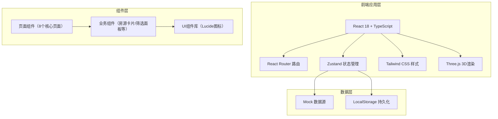
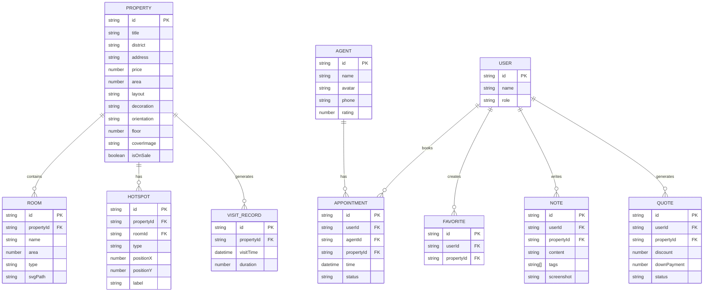

## 1. 架构设计



## 2. 技术说明

- **前端框架**：React 18 + TypeScript
- **构建工具**：Vite 5
- **路由**：react-router-dom v6
- **状态管理**：zustand
- **样式方案**：Tailwind CSS 3
- **3D渲染**：three + @react-three/fiber + @react-three/drei
- **图标库**：lucide-react
- **数据持久化**：LocalStorage（收藏/笔记/报价单）
- **后端服务**：无后端，采用Mock数据模拟

## 3. 路由定义

| 路由 | 页面用途 |
|------|----------|
| `/` | 房源列表页（首页） |
| `/property/:id/floorplan` | 户型详情页 |
| `/property/:id/roam` | 虚拟漫游页 |
| `/property/:id/tour` | 在线讲解页 |
| `/compare` | 房源对比页 |
| `/notes` | 看房笔记页 |
| `/quote` | 报价意向页 |
| `/admin` | 管理后台页 |

## 4. 数据模型

### 4.1 数据模型定义



### 4.2 Mock数据定义

```typescript
// 房源数据
interface Property {
  id: string;
  title: string;
  district: string;
  address: string;
  price: number;        // 万元
  area: number;         // 平方米
  layout: string;       // 如 "3室2厅2卫"
  bedrooms: number;
  livingrooms: number;
  bathrooms: number;
  decoration: '毛坯' | '简装' | '精装' | '豪装';
  orientation: '南' | '北' | '东' | '西' | '南北' | '东南' | '西南';
  floor: string;        // 如 "15/32层"
  coverImage: string;
  images: string[];
  isOnSale: boolean;
  builtArea: number;    // 建筑面积
  netArea: number;      // 套内面积
  rooms: Room[];
  hotspots: Hotspot[];
  pricePerSqm: number;  // 单价元/㎡
  community: string;    // 小区名
  year: number;         // 建成年份
}

interface Room {
  id: string;
  name: string;
  area: number;
  type: 'livingroom' | 'bedroom' | 'kitchen' | 'bathroom' | 'balcony' | 'study';
  svgPath: string;
  position: { x: number; y: number };
}

interface Hotspot {
  id: string;
  roomId: string;
  type: 'room' | 'info' | 'furniture';
  position: { x: number; y: number; z: number };
  label: string;
  targetRoomId?: string;
}

interface Agent {
  id: string;
  name: string;
  avatar: string;
  phone: string;
  rating: number;
  deals: number;        // 成交数
  experience: number;   // 从业年限
  specialties: string[];
}

interface Note {
  id: string;
  propertyId: string;
  propertyTitle: string;
  content: string;
  tags: string[];
  screenshot?: string;
  createdAt: string;
}

interface Appointment {
  id: string;
  propertyId: string;
  agentId: string;
  time: string;
  status: 'pending' | 'confirmed' | 'completed' | 'cancelled';
  userName: string;
  userPhone: string;
}

interface VisitRecord {
  id: string;
  propertyId: string;
  propertyTitle: string;
  visitTime: string;
  duration: number;     // 秒
  userName: string;
}
```
